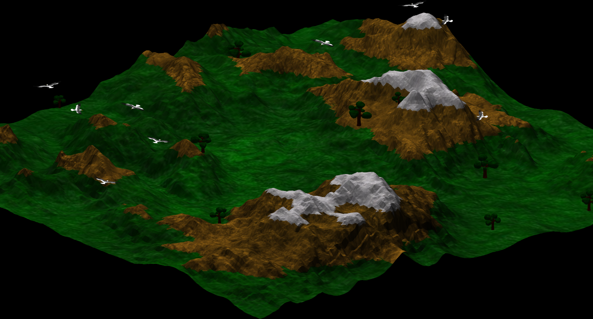
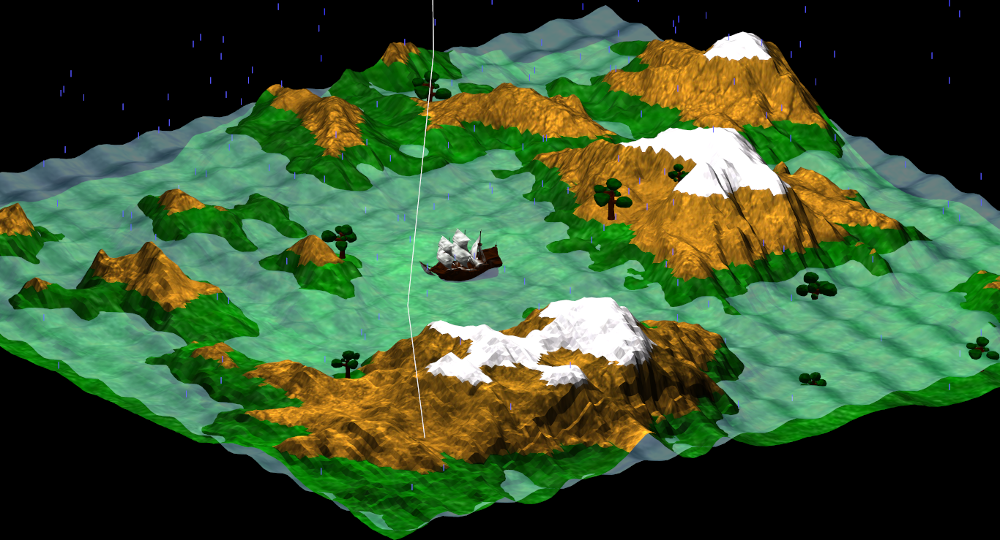

- Les controles :
 - controles de base pour tout ce qui est zoom/dezoom/rotation
 - rotation de la camera à la souris, il faut cliquer sur une fenêtre pour capturer le curseur
 - echap permet de libérer le curseur
 - tab quitte toutes les fenêtres
 - F5 pour le chargement
 - F6 pour la sauvegarde

Il n'y a plus qu'une seule fenêtre pour ce TP au lieu des quatre, une fenêtre supplémentaire permettant de changer les saisons est néamoins présente. Attention, elle peut se trouver trop à droite ou derrière la fenêtre principale si l'écran est trop petit.

Pour ce TP, tout à été passé en VAO + VBO, ce qui décharge grandement le processeur, mais qui peut mettre à mal la carte graphique. Cela a également permis de simplifier grandement l'utilisation de shaders.
Un shader est utilisé pour la map, il y a en tout trois textures, une pour la terre, une pour la pierre et une pour la neige. 

Un second shader est également utilisé pour l'eau, qui a également sa propre texture. La position de chaque vertex de l'eau est calculée dans le vertex shader.

L'utilisation du shader permet de ne pas modifier les données en mémoire et de rendre plus simple la modification de l'environnement, plus simple que si l'on devait modifier à la main les VAO/VBO

J'ai également ajouté un compteur de fps pour avoir une idée des performances. J'en ai profité pour appeler le update avec le temps réel passé entre chaque frame et non le temps défini au début par le QTimer qui peut être faux en cas de faibles performances.
